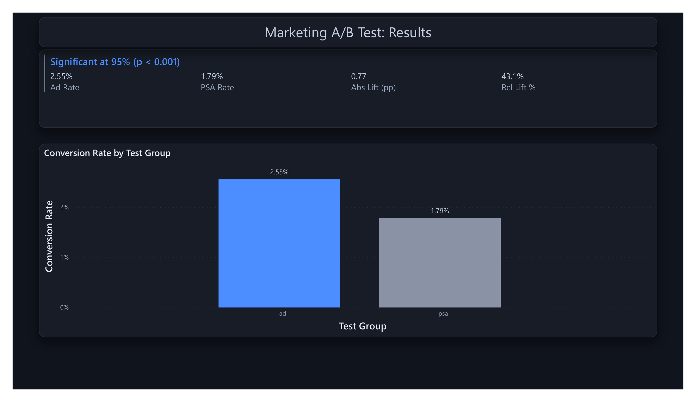
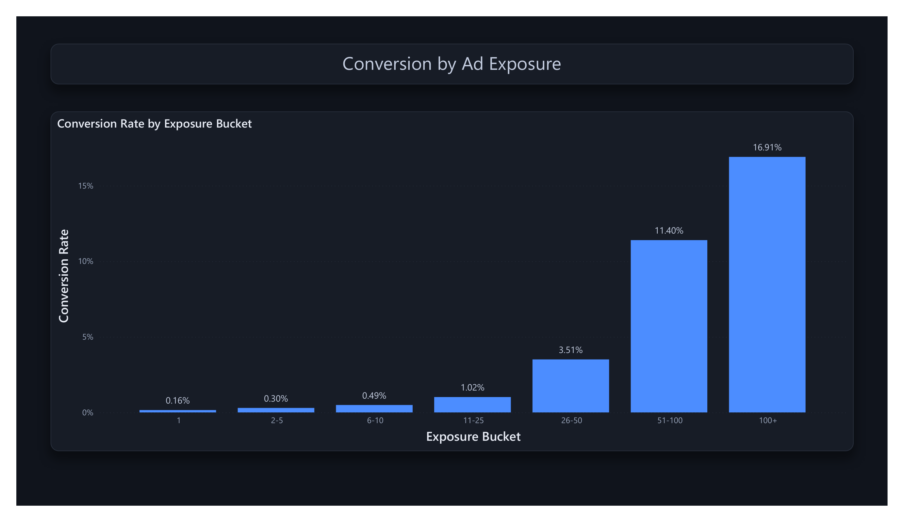
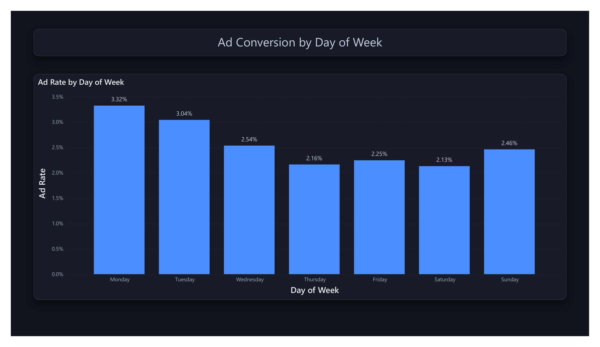
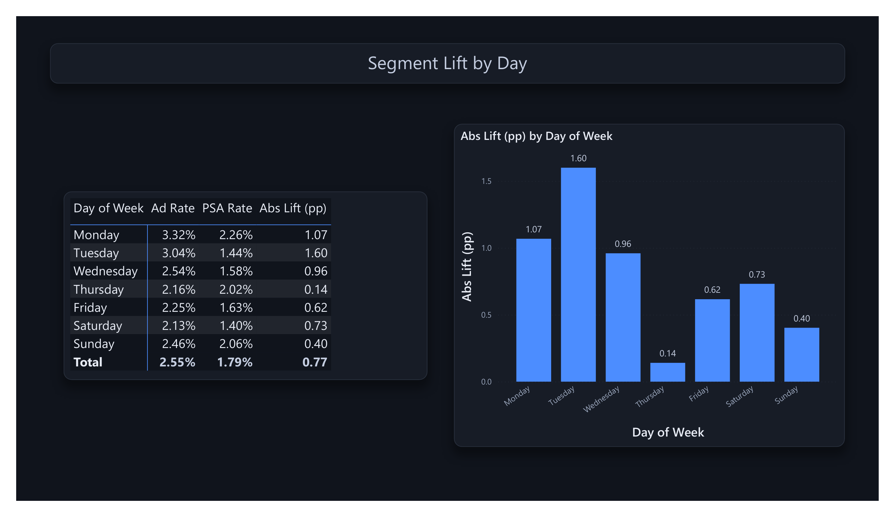

# Did the Ads Actually Work? A Marketing A/B Test

Analyzing a real marketing experiment of 588,101 users to answer a single question: did showing the ad cause more conversions than the public service announcement shown to the control group, and is that difference real or just noise?

This is a portfolio project. The data is a real ad-vs-PSA marketing experiment; the findings are for skill demonstration, not a campaign decision.

## The Questions

1. Did the ad group convert at a higher rate than the control, and is the difference statistically significant?
2. How large is the lift, and what is the confidence interval around it in real conversions?
3. Conversion climbs with the number of ads a person saw. Is that the ad working, or are engaged users just shown more ads?

## Stack

- **Python (Pandas, SciPy, statsmodels):** validate the data, run the two-proportion z-test, chi-square, confidence intervals, and a bootstrap
- **SQL (window functions, CTEs):** conversion rates by group, exposure buckets, cumulative conversion, segment lift
- **Power BI:** experiment results dashboard
- **GitHub:** version control

## Repo Structure

```
marketing-ab-test-analysis/
├── data/         # Raw CSV (gitignored, see Data below)
├── sql/          # SQL scripts, named by analysis
├── notebooks/    # Jupyter notebook for prep, testing, and EDA
├── powerbi/      # .pbix dashboard
├── screenshots/  # Dashboard page previews
└── README.md
```

## Dashboard

A four-page Power BI dashboard built per `powerbi/POWERBI_GUIDE.md`. The previews below are rendered from the same 588,101-user dataset the dashboard is built on.

**Results** — the verdict a hiring manager reads in ten seconds: lift, significance, and confidence interval.



**Exposure** — conversion climbs steeply with ads seen, but exposure was not randomized, so this is correlational.



**Timing** — which days and hours convert best in the ad group.



**Segments** — true treatment-vs-control lift by day. The largest lift (Tuesday) is not the highest ad rate (Monday), because the control rate moves too.



## Data

The dataset is not committed, to keep the repo light. Download it from Kaggle and drop the CSV into `data/raw/` to reproduce the analysis: [Marketing A/B Testing (Faviovaz)](https://www.kaggle.com/datasets/faviovaz/marketing-ab-testing). It is 588,101 rows, one per user, with columns: user_id, test_group (ad or psa), converted, total_ads, most_ads_day, most_ads_hour.

## Key Findings

Across 588,101 users in a real ad-vs-PSA experiment:

- **The ad worked.** The ad group converted at 2.55% versus 1.79% for the control, a 0.77 percentage point gain and a 43% relative lift.
- **The result is decisive.** A two-proportion z-test (z = 7.4, p ≈ 1.7e-13) and a chi-square test (54.3, df = 1) both reject equal conversion rates. The 95% confidence interval on the lift is about [0.60, 0.94] pp, and no bootstrap resample of 10,000 landed at or below zero.
- **The exposure pattern is a trap.** Conversion climbs from 0.16% (one ad seen) to 17% (100+ ads), and converters averaged 84 ads vs. 23 for non-converters. But exposure was not randomized, so this is correlational. Heavy exposure partly marks an already-engaged user. The clean causal evidence stays the ad-vs-control gap.
- **Timing matters.** Monday converted best at 3.32%, Thursday worst at 2.16%.

## Case Study

Full write-up (Problem, Approach, Insights, and what I would do with it) in [CASE_STUDY.md](CASE_STUDY.md).
